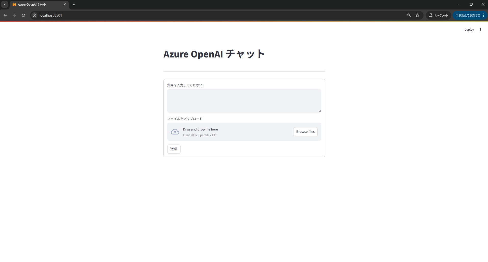

# Azure OpenAI チャット - NyAzuChat（ニャアズチャット）

## 📝 概要
Azure OpenAI チャットのWebアプリ

- アプリ名：NyAzuChat（ニャアズチャット）
→ Nya(猫の鳴き声ニャー) + Azure(アジュール) + Chat(チャット) の略語。

## 🛠️ 技術スタック
- Azure OpenAI (Chat用モデル)[gpt-4o または gpt-4o miniなど]
- 開発言語：Python
- GUI：Streamlit (UI)

## ⚙️ セットアップに関する設定、ローカル環境での実行手順、および、Azure App Serviceへのデプロイ手順
詳細な手順は `doc/setup_guide.md` を参照してください。

## 💰 料金が発生する状況
Azure OpenAI Service は無料プランの提供がありません。このため、料金が発生します。30日間の無料クレジットをお持ちの場合、ご利用料金はそのクレジットから補填されるため、お支払いなしで使用できます。

## ▶️ デモ動画URL
デモ動画(※音声なし)URL  
https://www.youtube.com/watch?v=JMjKXlmx5sg

## 🖼️ システム画面イメージ

### メイン画面
